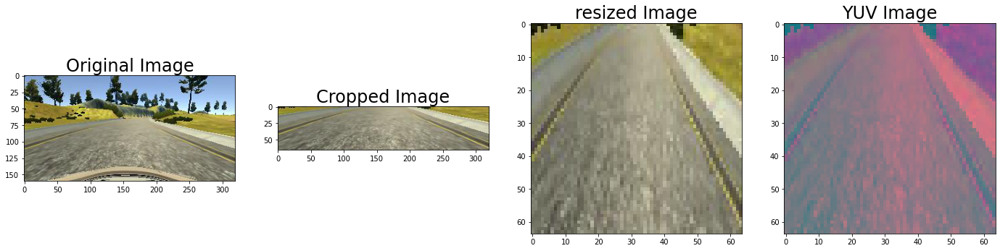

# **Behavioral Cloning** 

### Model Architecture and Training Strategy

#### 1. An appropriate model architecture has been employed

I have used multiple sources for this assignment.

#### Model Achitecture
I have used the model provided by NVIDIA .I did a slight modification to NVIDIA model i.e i have modified the model to take 64*64 instead of 66*200.Further model details has been mentioned below.

[NVIDIA Paper!](https://images.nvidia.com/content/tegra/automotive/images/2016/solutions/pdf/end-to-end-dl-using-px.pdf)

#### Data Augmentation ideas

I have read the below article and came to understanding how to augment my data

[Data Augmentation!](https://junshengfu.github.io/driving-behavioral-cloning/)

#### 2. Attempts to reduce overfitting in the model

Two dropout layer has been added with probability of setting each input to the layer to zero at 20% to overcome overfitting

#### 3. Model parameter tuning

The model used an adam optimizer with learning rate of 0.0001.
No of EPOCHS = 10
Validation data Split = 0.2
Batch Size = 32
loss = mse
learning rate = 0.0001
Optimize = Adam

#### Finalizing Epochs
I have started with 3 epochs which didnt give a fruitful output,later i have increased to 5 epochs and i could see some improvements but still the results are not satisfactory.Then i have increased to 8 epochs and i could see the model was working fine,however at some image the car is moving out of confined lines.So finally i have increased to 10 epochs which gave me satisfactory results.
#### Validation data Split
I have read in many articles that a split 80:20 or 90:10 is a good training and validation data split.So i choose 80% of training data and 20% of validation data.Below is the link where i have read about good training and validataion data split

[Optimal Training and Validation data split!](https://stackoverflow.com/questions/13610074/is-there-a-rule-of-thumb-for-how-to-divide-a-dataset-into-training-and-validatio)

#### Loss function
I have used most commonly used loss function as it gave me satisfactory results i didn't research further for other loss functions

#### Optimizer and Learning rate
I have used Adam Optimizer with a learning rate of 0.001(i reused same learning rate as my previous assignment)

#### 4. Appropriate training data

I have used dataset provided by udacity to train my model.Using Sklearn library i have split training and validation dataset,splitting 20% for validation and remaing for training data.Instead of inserting all the images into numpy array and performing model fit,i chose to generate the dataset into batches and each batch containing 32 images.This helped in consuming less memory in RAM.

### Model Architecture and Training Strategy

#### 1. Data Preprocessing
Below are my image preprocessing techniques i have applied.

1.Image normalization technique which is taken care by lambda layer in my model.
(Lambda(lambda x: x / 128.0 - 1., input_shape=(64,64,3))
2.As part of image preprocessing i have performed 3 steps. 
  * Cropping the image to train ony region of interest
  * Resize the image to 64 * 64, this will help the train the model faster and will help in optimizing my final model
  * Converted from RGB to YUV as mentioned in the NVIDIA model.
3.Flipped the image horizontally and changed the steering angle value by a factor of -1.
4.Since we have images from three cameras(left,center and right),i have used a correction factor of 0.2.For left images steering angle with a correction factor of 0.2 has been added and for right images steering angle with correction factor 0f 0.2 has been subtracted.

#### 2. Final Model Architecture

I did some modifications to NVIDIA model and final model is as below.

| Layer (type)        	|     Output Shape		|    Param #	|
|:---------------------:|:---------------------:|--------------:| 
| lambda_3 (Lambda)     | (None, 64, 64, 3) 	|   0     		|
| conv2d (Conv2D)      	| (None, 30, 30, 24)   	|   1824   		|
| conv2d_1 (Conv2D)		| (None, 13, 13, 36) 	|   21636  		|
| conv2d_2 (Conv2D)    	| (None, 5, 5, 48)    	|   43248  		|
| conv2d_3 (Conv2D)	    | (None, 3, 3, 64)		|   27712  		|
| conv2d_4 (Conv2D)		| (None, 1, 1, 64) 		|   36928  		|
| flatten (Flatten)		| (None, 64)           	|   0    		|
| dense (Dense)  	    | (None, 1164)       	|   75660  		|
| dropout (Dropout)		| (None, 1164)  		|   0     		|
| dense_1 (Dense) 		| (None, 100)			|   116500 		|
| dropout_1 (Dropout)	| (None, 100)			|   0     		|
| dense_2 (Dense)  		| (None, 50)			|   5050   		|
| dense_3 (Dense) 		| (None, 10)			|   510    		|
| dense_4 (Dense)		| (None, 1)				|   11    		|

Total params: 329,079
Trainable params: 329,079
Non-trainable params: 0

* The sequential model starts with a lambda layer which performs image normlization.
* The model has total of 5 convolutional layers.The first 3 convolution layers has 2*2 stride and 5*5 kernel and remaining 2 layers are non strided convolution layer with 3*3 kernel.
* For all 5 convolution layer a elu activation function has been added.
* After that i have applied a flattening layer to create a single long feature vector to be used for dense layers.
* Next i have added 5 fully connected layers with output 1164,100,50,10 and 1 respectively.
* For the first two fully connected layers i have added a droput layers with probability of 80% for picking a input
* The model has been compiled with Adam optimize with learning rate of 0.0001 with loss function "mean square error(mse)".

The Video output of the Autonomous car driven model can be found below

