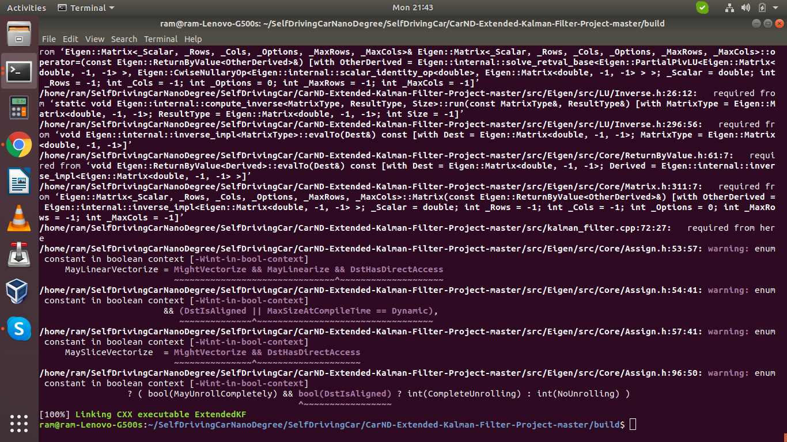
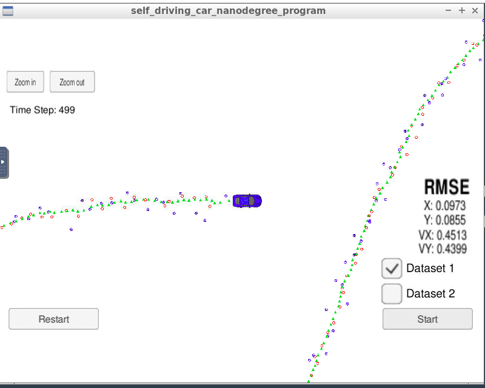

# Extended Kalman Filter Project Starter Code
## Project  Rubric

### Code must compile without errors with cmake and make

Code has been compiled without any errors.Below is the output of build.

The binary can be found "./build/ExtendedKF"

### Your algorithm will be run against Dataset 1 in the simulator which is the same as "data/obj_pose-laser-radar-synthetic-input.txt" in the repository. We'll collect the positions that your algorithm outputs and compare them to ground truth data. Your px, py, vx, and vy RMSE should be less than or equal to the values [.11, .11, 0.52, 0.52].

My px,py,vx and vy RMSE are 0.0973,0.0855,0.4513,0.4399. The output image can be found below.

### While you may be creative with your implementation, there is a well-defined set of steps that must take place in order to successfully build a Kalman Filter. As such, your project should follow the algorithm as described in the preceding lesson.

I have followed the algorithm as described in the lessons.

* For calculating rho,theta,rho_dot i have used formula mentioned in Sensor Fusion EKF reference document,Section-7 Radar Measurements
* For kalman filter predict i have used the formula mentioned in the classroom trainings and quiz.
* For Calculating RMSE and Jacobian i have followed the methods mentioned in the classroom.

### Upon receiving a measurement after the first, the algorithm should predict object position to the current timestep and then update the prediction using the new measurement.

This has been handled and the code can be found [here!](./src/FusionEKF.cpp). Line number 149 does the prediction and line number 159 and 166 has radar and laser updation respectively.

