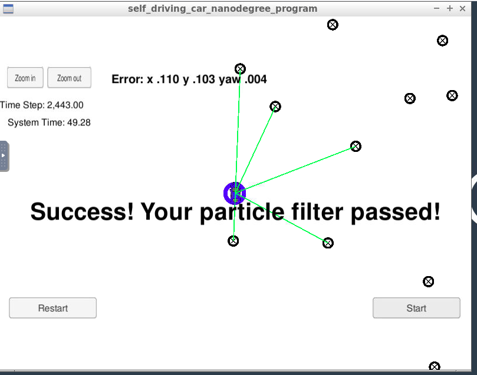

# CarND-Kidnapped-Vehicle-Project-master

## Project Rubric

### This criteria is checked automatically when you do ./run.sh in the terminal. If the output says "Success! Your particle filter passed!" then it means you’ve met this criteria.
### This criteria is checked automatically when you do ./run.sh in the terminal. If the output says "Success! Your particle filter passed!" then it means you’ve met this criteria.
I have coded,built and ran the ./particle_filter and it was successful.Below image depicts the same.

### There may be ways to “beat” the automatic grader without actually implementing the full particle filter. You will meet this criteria if the methods you write in particle_filter.cpp behave as expected.

I had made sure to implement actual particle filter and didnt find a way to beat the automatic grader.My code changes has been mentioned below.

* number of particles of 200 has been set.I started with 100 particle filters,eventhough the particle filter has passed i played around with 200 and reduced the error.
* For each particle id,x,y,theta,weights has been initialized and added to particles vector
* Implemented prediction function using the formula mentioned in the coursework
* Implemented data association i.e taking the nearest prediction
* Updated the weights using the formulas mentioned in the coursework
* Finally resampled the particles.

