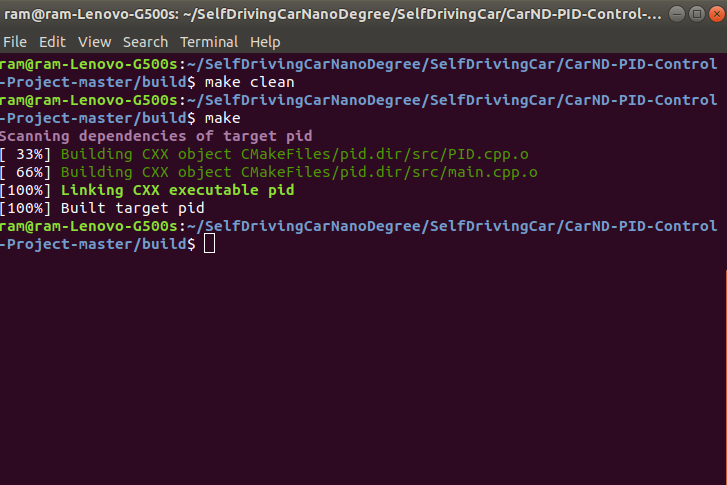

# CarND-Controls-PID

Self-Driving Car Engineer Nanodegree Program

## Project Rubric

### 1. Your code should compile.

The code has compiled correctly and compilation output can be seen below.

### 2. The PID procedure follows what was taught in the lessons.

My PID procedure follows what was taught in the lessons.I have continously applied correction based on PID for the cross track error received.
In PID.cpp file i have initialized p_error,i_error,d_error with <values> respectively.
The coefficients(Kp,Ki,Kd) chosen for proportional,Integral and Derivative are <value> respectively.The code changes can be found in main.cpp file in line number

### 3. Describe the effect each of the P, I, D components had in your implementation.

#### P Control Effect

Proportional control is proprtional to cross track error but in opposite direction. If we only use Proportional control,as mentioned in the udacity coursework the car overshoots as in the car weaves a lot and will go out of track after travelling some distance.The same can be seen in the below gif.

#### Only 'P' Controller

#### I Control Effect

Integral control is used to adress the problem systematic bias like misaligned wheels.Including 'Integral control' in PID would help in minimizing CTE.Only using Integral value will make the car runaround in circles.

#### Only 'I' Controller

#### D Control Effect
Derivate control helps the car not to overshoot i.e minimizing the effect if we use only P control and inturn makes the car drive smooth along the track.If we use only D controller we can see the car moving smoothly,however going outside the track.

#### Only 'D' Controller

### 4. Describe how the final hyperparameters were chosen.

I have fine tuned the parameters by trail and error method.For example when i tried large integral value the car immediately goes out the track and tries to run in circles. So i realized having low integral value will help the car drive in the track.
Smaller Derivate value was not helping at all as the car was oscilating and going outside the track. So i realized having high Derivate value will help the car drive inside the track.For proportional control i started the value mentioned in question and answer section and slowly reduced it till i hit the sweet spot.

My final hyperparameters are 

|     PID               |     Values    	 	|
|:---------------------:|:---------------------:|
| initial p_error    	|  0.6       			|
| initial i_error   	|  0.09   				| 
| initial d_error   	|  0.1					|
| p coefficient   		| -0.099        		| 
| i coefficient			| -0.0022           	| 
| D coefficient			| -0.72             	|

### 5. The vehicle must successfully drive a lap around the track.

With the above code changes and final hyperparameters the car is not leaving the drivable portion of the track.There was not instance of car driving over the ledges.The successful lap is shown below

