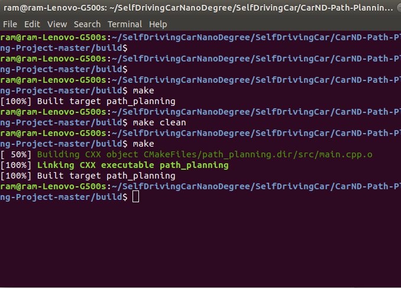
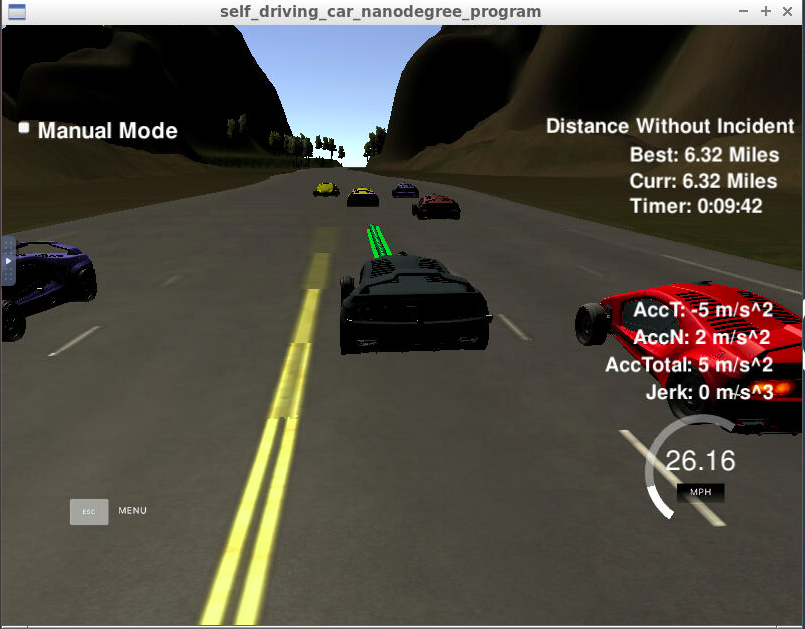

# CarND-Path-Planning-Project
Self-Driving Car Engineer Nanodegree Program
  
## Project Rubric

###  The code compiles correctly.
The code has compiled correctly and compilation output can be seen below.

### The car is able to drive at least 4.32 miles without incident.

With my changes the car was able to drive more than 4.32 miles without any incidents. The below image depicts the same.

### The car drives according to the speed limit.

I set the speed limit to 49.9 and during the whole 4.32 mile drive there was no instance of car driving above the speed limit

### Max Acceleration and Jerk are not Exceeded.

I set the max accelaration to 0.224 and during the whole 4.32 mile drive there was no instance of car driving above the max acceleration limit

### Car does not have collisions.

There was no instance of collision during the 4.32 mile drive

### The car stays in its lane, except for the time between changing lanes.

The car stays always in the lane and only change lanes when required.

### The car is able to change lanes

Whenever there is a car ahead which is driving slow and there are no cars in any of the other lanes the car is able to change the lanes.

### There is a reflection on how to generate paths.

*After capturing Sensor fusion data in a two dimensional vector(line no 144), using a range based for loop gone through the vector,found in which lane the car is in(line no 20), calculated speed,estimated the car position(after executing previous tragectory) and using the function getCarPosition(line no 41) found the whether the car is "AHEAD","LEFT","RIGHT" and stored in a set.

* Using the set of all the cars around checked whether to stay in the lane,go left or right or go in reduced speed so that the ego car will not collide the car ahead of it i.e if there is a car ahead either we have to go left or right or slow down.This decision is based on by checking in the set previously populated and whether lane is > 0 or lane != 2.

* Using the car_x,car_y,car_yaw, i have calcualted previous points if there are less than 2 previous points othewise i have used the last two points(from line no 200-232).After that i have set 3 future waypoints using car positions,lane and waypoints of x,y and s. I have used getXY helper function as car_s is having frenet cordinates.later i have converted to car local co-ordinates(line no 236-253).As mentioned in the Q & A video i have used spline for trajectory generation and initialized the spline with ptsx and ptsy. Next, i have added the previous points for continuity to the future path(line no 261-265).Target point has been set ahead of 30ms to the current point,passing x to spline gives y point.Finally, i had calculated x,y's along the spline and for the same x,y's i have rotated and shifted back to global coordinates and added to next x,y value vector.