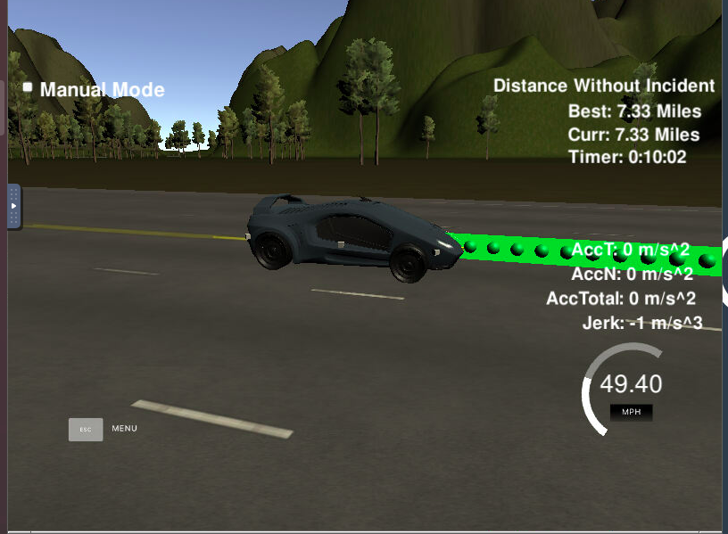

# CarND-Path-Planning-Project
Self-Driving Car Engineer Nanodegree Program
  
## Project Rubric

###  The code compiles correctly.
The code has compiled correctly and compilation output can be seen below.

### The car is able to drive at least 4.32 miles without incident.

With my changes the car was able to drive more than 4.32 miles without any incidents. The below image depicts the same.

### The car drives according to the speed limit.

I set the speed limit to 49.9 and during the whole 4.32 mile drive there was no instance of car driving above the speed limit

### Max Acceleration and Jerk are not Exceeded.

I set the max accelaration to 0.224 and during the whole 4.32 mile drive there was no instance of car driving above the max acceleration limit

### Car does not have collisions.

There was no instance of collision during the 4.32 mile drive

### The car stays in its lane, except for the time between changing lanes.

The car stays always in the lane and only change lanes when required.

### The car is able to change lanes

Whenever there is a car ahead which is driving slow and there are no cars in any of the other lanes the car is able to change the lanes.

### There is a reflection on how to generate paths.