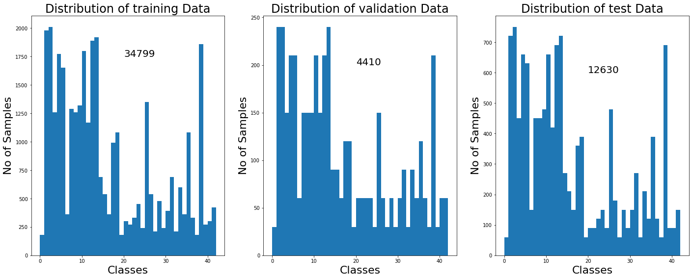

# **Traffic Sign Recognition** 

## Writeup

### Data Set Summary & Exploration

#### 1. Provide a basic summary of the data set. In the code, the analysis should be done using python, numpy and/or pandas methods rather than hardcoding results manually.

* The number of examples in training set is 34799
* The number of examples in validation set is 4410
* The number of examples in test set is 12630
* The shape of a traffic sign image is (32, 32, 3)
* The number of unique classes/labels in the data set is 43

#### 2. Include an exploratory visualization of the dataset.

* Three charts has been plotted to visualize the data set.
* Each individual chart gives information of number of samples available for each class number
* The charts plotted visualizes training,validation and testing samples.

As we can see from the charts,samples vary as high as ~2000 to as low as 200~.Predicting traffic signs with low samples may not be accurate.
 

### Design and Test a Model Architecture

#### 1. Describe how you preprocessed the image data. What techniques were chosen and why did you choose these techniques? Consider including images showing the output of each preprocessing technique. Pre-processing refers to techniques such as converting to grayscale, normalization, etc. (OPTIONAL: As described in the "Stand Out Suggestions" part of the rubric, if you generated additional data for training, describe why you decided to generate additional data, how you generated the data, and provide example images of the additional data. Then describe the characteristics of the augmented training set like number of images in the set, number of images for each class, etc.)

* As a first step, I decided to convert the images to grayscale.I have used OpenCV "cvtColor(image,cv2.COLOR_RGB2GRAY)" to convert RGB images to gray

* Then i have reshaped the image to 32,32,1

* Next i have used this "(pixel - 128)/ 12" formula to normalize the image.

* Then i have used sklearn shuffle to shuffle the images randomly to

![Gray Normalized Image] (./Output/original_gray_normalized.png)

#### 2. Describe what your final model architecture looks like including model type, layers, layer sizes, connectivity, etc.) Consider including a diagram and/or table describing the final model.

I have followed lenet-5 architecture with some modifications i.e, i have added extra convulutional layer and added two drop out layers.

Below is the image of lenet Architecture

![Lenet Architecture] (./Output/Lenet_Arch.png)

My final model consisted of the following layers:

| Layer         		|     Description	        					| 
|:---------------------:|:---------------------------------------------:| 
| Input         		| 32x32x1 Gray image   							| 
| Convolution 5x5     	| 1x1 stride, valid padding, outputs 28x28x6 	|
| Relu					| Relu Activation								|
| Max pooling	      	| 2x2 stride,  outputs 14x14x6, valid padding	|
| Convolution 5x5	    | output 10x10x16								|
| Relu           		| Relu Activation								|
| Max pooling			| 2x2 string,valid padding,outputs 5x5x16		|
| Convolution 5x5	    | output 1x1x400								|
| Relu           		| Relu Activation								|
| Flatten				| outputs 400									|
| Fully connected		| outputs 120									|
| Relu          		| Relu Activation								|
| Drop Out      		| Keep Probability 80%							|
| Fully connected		| outputs 84									|
| Relu          		| Relu Activation								|
| Drop Out      		| Keep Probability 80%							|
| Fully connected		| outputs 43									|

#### 3. Describe how you trained your model. The discussion can include the type of optimizer, the batch size, number of epochs and any hyperparameters such as learning rate.

I ran 40 epochs which gave accuracies as below
training Accuracy = 0.999
Validation Accuracy = 0.951
test Accuracy = 0.945
I used adam optimizer with learning rate of 0.001
The BATCH_SIZE is 128.

I have obtained values during udacity course lesson 13,36 and 37 i.e lab:lenet in tensorflow and lab:lenet workspace.
I tried changing the learning rate 0.01 it didnt change the accuracy.I have modfied the model compared to previous submission
by adding two dropout layers with probability of 0.7.

I did a trail and error method to finalize the epochs to acheive accuracy of more than 93% and acheived 94.8% accuracy.
I started with 10 epochs which gave me accuracy of 91%,after that i tried 20 epochs which gave me an accuracy of 92% ,30 epoch gave me an accuracy around 94%. 40 epochs gave me accuracy of 95%.I have increased epochs to 50 the validation accuracy was fluctuating between 94 and 95 and i decided that validation accuracy of ~95% is the maximum that i can acheive with model and chose 40 epochs.

However the prediction of random webimages gave me an accuracy of only 60% which is huge deviation with my model accuracy.

#### 4. Describe the approach taken for finding a solution and getting the validation set accuracy to be at least 0.93. Include in the discussion the results on the training, validation and test sets and where in the code these were calculated. Your approach may have been an iterative process, in which case, outline the steps you took to get to the final solution and why you chose those steps. Perhaps your solution involved an already well known implementation or architecture. In this case, discuss why you think the architecture is suitable for the current problem.

If a well known architecture was chosen:
* What architecture was chosen?
I have chosen lenet architecture with some modifications
* Why did you believe it would be relevant to the traffic sign application?
I have read lenet architercure is an excellent first architecture like 'hello world' for deep learning,simple to understand and straightforward.Also in the udacity course lenet architecture was mentioned, i thought it would be a bit easier to implement lenet architecture incase i am stuck at some place i can easily look at course material and arrive to a conclusion.
* How does the final model's accuracy on the training, validation and test set provide evidence that the model is working well?
   My final model results were:
      * training set accuracy of 0.999
      * validation set accuracy of 0.951
      * test set accuracy of 0.945
   Based on the above accuracies for training,validation and test data i believe my model is working above par.However it also 
   depends how my model predicts random images taken from the internet.

### Test a Model on New Images

#### 1. Choose five German traffic signs found on the web and provide them in the report. For each image, discuss what quality or qualities might be difficult to classify.

Here are five German traffic signs that I took from web:

![60 kms] (./webimages/60_kmh.jpg)
![stop_sign] (./webimages/stop_sign.jpg)
![yield_sign] (./webimages/yield_sign.jpg)
![left_turn] (./webimages/left_turn.jpg)
![road_work] (./webimages/road_work.jpg)

#### 2. Discuss the model's predictions on these new traffic signs and compare the results to predicting on the test set. At a minimum, discuss what the predictions were, the accuracy on these new predictions, and compare the accuracy to the accuracy on the test set (OPTIONAL: Discuss the results in more detail as described in the "Stand Out Suggestions" part of the rubric).

Here are the results of the prediction:

| Image			        |     Prediction	 	| Probability			| 
|:---------------------:|:---------------------:|:---------------------:|
| 60_kmh.jpg      		| No passing  			| 1.000000      		|
| stop_sign.jpg			| Stop   				| 1.000000      		|
| yield_sign.jpg		| Yield					| 1.000000      		|
| left_turn.jpg   		| Turn left ahead		| 1.000000      		|
| road_work.jpg			| Speed limit       	| 1.000000      		|

The model was able to correctly guess 3 of the 5 traffic signs, which gives an accuracy of 60%.However,my model test accuracy is 93% which is a huge deviation.I believe accuracy on random images can be improved by using other image augmentation techniques.

#### 3. Describe how certain the model is when predicting on each of the five new images by looking at the softmax probabilities for each prediction. Provide the top 5 softmax probabilities for each image along with the sign type of each probability. (OPTIONAL: as described in the "Stand Out Suggestions" part of the rubric, visualizations can also be provided such as bar charts)

Below are the 5 softmax probabilities for each image
NFO:tensorflow:Restoring parameters from ./lenet
Image: ./webimages/left_turn.jpg
Probabilities:
   1.000000 : 34 - Turn left ahead
   0.000000 : 0 - Speed limit (20km/h)
   0.000000 : 1 - Speed limit (30km/h)
   0.000000 : 2 - Speed limit (50km/h)
   0.000000 : 3 - Speed limit (60km/h)

Image: ./webimages/yield_sign.jpg
Probabilities:
   1.000000 : 13 - Yield
   0.000000 : 0 - Speed limit (20km/h)
   0.000000 : 1 - Speed limit (30km/h)
   0.000000 : 2 - Speed limit (50km/h)
   0.000000 : 3 - Speed limit (60km/h)

Image: ./webimages/60_kmh.jpg
Probabilities:
   1.000000 : 9 - No passing
   0.000000 : 0 - Speed limit (20km/h)
   0.000000 : 1 - Speed limit (30km/h)
   0.000000 : 2 - Speed limit (50km/h)
   0.000000 : 3 - Speed limit (60km/h)

Image: ./webimages/stop_sign.jpg
Probabilities:
   1.000000 : 14 - Stop
   0.000001 : 1 - Speed limit (30km/h)
   0.000000 : 0 - Speed limit (20km/h)
   0.000000 : 2 - Speed limit (50km/h)
   0.000000 : 3 - Speed limit (60km/h)

Image: ./webimages/road_work.jpg
Probabilities:
   1.000000 : 0 - Speed limit (20km/h)
   0.000000 : 1 - Speed limit (30km/h)
   0.000000 : 2 - Speed limit (50km/h)
   0.000000 : 3 - Speed limit (60km/h)
   0.000000 : 4 - Speed limit (70km/h)
   
 In the below image the top 5 softmax probabilities has been captured.For correct predictions the softmax probabilites is 100%.
 For incorrect predictions i can see atleast in the top 5 probilities actual image is listed for 1 image(60_kmh) and for other image prediction(road_work) is totally wrong.
 
 ![SoftMax Probabilities] (./Output/softmax.png)

### Additional Notes
For previous submission i have added few chanes releated to image preprocessing,epochs,changing how normalization is done,adding extra convulutional layer and two drop out layers to my model.I belive this has improved my accuracy from 40%(previous submission) to 60%(Current submission)

